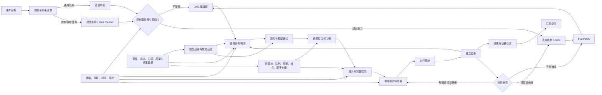

# CostWeave v0.4 升级路线：Adaptive Runtime

> 文档状态：设计基线  
> 设计修订：R3（加入资源经济联合优化、结果分布预测与图像/视频制作工作流）  
> 原始设计基线：v0.3.0  
> 当前实现基线：v0.4.1  
> 目标版本：v0.4.0  
> 版本定位：从“离线启发式编排原型”升级为“可持久化、可观测、可校准的自适应多模型运行时”

> 实施说明：本文件是总体技术蓝图，不作为单次开发清单。稳定交付顺序见 [`V0.4_INCREMENTAL_RELEASES.md`](V0.4_INCREMENTAL_RELEASES.md)，通过 v0.4.1～v0.4.9 九个版本逐步完成；v0.4.1 被刻意限制为低额度的合同与状态守卫版本。

## 1. 版本结论

v0.4 不应继续以增加关键词、模型条目或评分规则为主。下一步最重要的是建立可靠的控制平面，使 CostWeave 能在执行前回答六个问题：

1. 这个任务真正需要哪些能力，判断本身有多不确定？
2. 什么结果才算成功，首轮成功、修复后成功、质量、成本和时间分别可能落在哪个区间？
3. 哪个“模型 × Provider × 硬件池 × 推理配置 × 开始时间”组合满足质量、期限与风险约束？
4. 整个任务图怎样拆分、合并、批处理和并行，才能使预期总成本而非单次调用价格最低？
5. 本地资源此刻是否有能力按期完成，还是应在第一次调用前直接转向云端或延后？
6. 运行中的新证据是否足以继续、局部升级、局部重规划或全局重规划？

因此，v0.4 的中心不是“更像聊天机器人的总指挥”，而是一个确定性的控制内核：



LLM 可以提出任务画像、计划或修订建议，但不能直接修改运行状态、预算账本、权限和已验收成果。所有建议必须经过 Schema、策略、DAG 和预算检查，转换成受控命令后才能生效。

这里的“总成本”包括货币、算力机会成本、排队与期限代价、失败返工、模型交接、验收和结果失效成本。这里的“结果预期”不是单个成功率，而是包含多种结局及不确定性的可校准分布。

## 2. v0.4 的范围

### 2.1 必须完成

- 事件溯源式运行记录与可重放状态
- 明确且可验证的运行、任务、审批状态机
- 以 Artifact 为中心的 DAG 和模型间结构化交接协议
- 执行前准入控制、容量预测、背压和熔断
- 模型、Provider、硬件池、推理配置和开始时间的联合资源配置
- 本地 CPU/GPU、能源、占用、排队和稀缺容量的资源经济模型
- 拆分、并行、合并、缓存和批处理收益的执行计划评估
- 以端到端预期总成本为目标的路由，而不是只比较第一次调用价格
- 图像、短视频和 AI 电影任务的领域识别、视觉圣经、分镜 DAG 与 `ShotContract`
- 多媒体 Prompt 自动编译、关键帧/动态分镜门、镜头级并行与局部返工
- 角色、场景、风格、运镜和时间连续性的专用验收
- 按帧、秒、分辨率、重渲染和后处理计算的媒体成本账本
- 规划升级门与可验证的 `PlanPatch`
- 非阻塞审批：只暂停受影响节点
- 细粒度失败分类与局部恢复
- 首次成功、修复后成功、最终质量、成本、时间和误验收风险的分布预测
- 预测置信度、分布外检测、相关失败因素和实时重估
- 可归因、可版本化的运行结果与能力后验数据
- 离线回放、仿真对照和影子评估框架
- 运维、路由解释、审批与评估页面

### 2.2 明确不做

- 不在生产任务中进行无约束的在线探索
- 不让系统自动修改自身源代码、策略或基础模型权重
- 不在缺少真实数据时宣称成功率已经校准
- 不为了覆盖数量一次接入所有模型厂商
- 不把本地服务直接暴露到公网
- 不把“先让便宜模型试一次，失败再升级”作为默认路线
- 不在 v0.4 训练复杂的神经路由器；v0.4 先建立可信数据和评估基础
- 不在没有真实硬件适配器时伪造真实 GPU 利用率；默认资源数据明确标记为仿真
- 不把质量、时间和成本随意压成一个不可解释的综合分数
- 不在 v0.4 默认包中直接调用付费图像或视频模型；先用可复现的媒体仿真适配器验证控制逻辑

真实模型适配器可以在 v0.4 后段以接口和少量试验实现存在，但核心发布不依赖用户提供 API Key。默认仍提供可复现的仿真适配器。

## 3. 设计原则

### 3.1 控制内核确定性，LLM 负责认知建议

| 能力 | 归属 |
|---|---|
| 状态转换、锁、幂等、预算、权限、超时 | 确定性控制内核 |
| 任务理解、语义拆解、方案生成、原因分析 | 本地或云端 LLM |
| DAG 合法性、Schema、Artifact 完整性 | 确定性验证器 |
| 开放式质量评价 | 独立 Judge，且不能仅依赖执行模型自评 |
| 路由与升级 | 策略引擎根据数据作出，LLM 可提供特征但无最终写权限 |

本地模型作为唯一总指挥没有意义；昂贵模型永久担任全部总指挥也不经济。推荐结构是：

```text
确定性 Meta Controller
├── 本地画像器 / 规划器：处理清晰、低风险、分布内任务
├── 云端 Planner / Critic：处理低置信、高风险、复杂依赖和重规划
└── 独立 Validator：用测试、规则、证据或不同模型验收
```

### 3.2 先判定，后执行

路由的默认动作不是逐级尝试，而是一次性估计候选组合的质量、成本、失败代价、排队时间和期限风险。只有暂时性故障或证据表明局部修复更便宜时才重试。

### 3.3 质量门约束保守下界

模型的平均成功率不能直接作为保证。所有关键路由使用置信下界：

```text
P_success_lower(model, task, context) >= task.quality_floor
```

冷启动、样本少、模型版本变化、任务分布漂移都会拉低下界，而不是给出虚假的高置信度。

### 3.4 失败隔离

节点失败不等于整个任务必须推倒。只有根假设失效、任务边界错误或依赖结构错误才允许全局重规划。已验收且未被新证据推翻的兄弟分支应继续复用。

### 3.5 所有学习数据必须可归因

每个结果必须能追溯到任务画像版本、计划版本、模型目录修订、模型版本、提示词版本、工具版本、策略版本、输入 Artifact、执行尝试和验证方法，否则不得进入能力更新。

### 3.6 约束优先，优化次之

质量、风险和硬期限不是用低价格抵消的普通加权项。选择顺序是：

1. 淘汰不满足能力、质量下界、权限、风险、容量和期限的方案。
2. 在可行方案中最小化端到端预期总成本。
3. 成本接近时，依次选择尾延迟更低、故障相关性更小、资源峰值更低的方案。

只有用户明确提供“时间价值”时，才把延迟折算为货币；否则期限作为硬约束、时间作为独立优化目标展示，避免权重设置掩盖真实取舍。

### 3.7 预测必须是分布且能够被证伪

每次预测必须同时给出均值、保守下界、区间、样本依据、分布外程度和主要失败模式。真实结果到达后必须计算预测误差。没有足够数据时可以回答“不确定”，不能用启发式小数制造精确感。

## 4. 难度、需求和风险模型

v0.3 的六维复杂度可保留，但 v0.4 必须拆开四个容易混淆的概念。

### 4.1 TaskDemandProfile

每个 DAG 节点保存连续向量，而不是只保存 L1–L10：

```json
{
  "cognitive": 0.82,
  "domain": 0.70,
  "evidence": 0.65,
  "tool": 0.55,
  "coordination": 0.76,
  "context": 0.61,
  "precision": 0.88,
  "aesthetic": 0.74,
  "identity_consistency": 0.91,
  "temporal_consistency": 0.86
}
```

- `cognitive`：多步推理、抽象、反事实和规划强度
- `domain`：专业知识深度
- `evidence`：事实核验、检索和引用要求
- `tool`：工具种类、调用精度和环境依赖
- `coordination`：依赖数量、跨分支接口和合并难度
- `context`：上下文长度、跨文件跨度和长程一致性
- `precision`：格式、数学、代码、法律或安全正确性的严格程度
- `aesthetic`：风格、构图、表演和镜头语言的主观要求
- `identity_consistency`：角色、服装、道具和场景跨镜头一致性
- `temporal_consistency`：动作、视线、空间、光照和时间连续性

总难度仅用于页面展示。路由必须使用完整向量，并关注最弱项。

### 4.2 WorkloadEstimate

难度高不等于工作量大。工作量单独描述：

- 输入、缓存输入和输出 Token
- 文件、数据行和工具调用数量
- 预计运行时长
- 可并行比例
- 内存、显存和并发槽需求
- 图像数量、视频秒数、分辨率、帧率、宽高比和候选数
- 关键帧、参考图、角色资产、音频、字幕、补帧、放大和剪辑工作量

### 4.3 UncertaintyProfile

- `intent_uncertainty`：是否正确理解用户目标
- `classification_uncertainty`：是否放入了正确任务族
- `epistemic_uncertainty`：当前证据是否足够
- `estimate_confidence`：上述画像本身有多可靠
- `out_of_distribution_score`：是否超出历史数据分布

### 4.4 RiskProfile

- 错误影响范围
- 可逆性
- 隐私和权限
- 安全、医疗、法律、金融等敏感性
- 错误能否被廉价检测
- 错误传播到下游的可能性

同一难度下，“可自动测试的代码格式化”和“不可逆的数据迁移”不能使用相同策略。

### 4.5 两阶段判断

难度判断分成两个时点：

1. 目标级粗判：决定是否需要高级模型参与规划，以及预留多少预算。
2. DAG 编译后的节点级精判：决定每个节点的模型、验证器和并发计划。

目标级难度不能直接复制给所有子任务。任务拆解后，必须结合节点边界重新计算需求向量。

### 4.6 MediaDemandProfile

识别到图像、动画、广告片、短视频或电影任务时，额外建立：

- 交付类型：单图、图组、镜头、场景、短片或完整影片
- 目标时长、分辨率、帧率、宽高比和声音要求
- 角色数量、场景数量、镜头数量与连续性跨度
- 摄像机运动、物理动作、口型、文字和特效复杂度
- 参考图、开始帧、结束帧、深度/姿态等条件输入
- 可接受候选数、首次通过目标和最大重渲染次数
- 用户对风格、剧情、角色和品牌元素的不可变约束

媒体任务的难度不能只由 Prompt 长度或视频时长决定。复杂动作、角色交互、镜头连续性和精确口型通常比静态风景过场更需要高能力模型。

## 5. 模型能力表示与恰好适配

### 5.1 静态事实与动态后验分离

模型目录继续保存上下文、价格、模态、工具、来源等静态事实。真实运行学习得到的能力数据放入独立的 `CapabilityPosterior`：

```json
{
  "model_revision": "provider/model@2026-07-01",
  "task_family": "code_review",
  "difficulty_bucket": "0.6-0.8",
  "tool_chain": "repo+tests",
  "context_bucket": "32k-64k",
  "alpha": 39.0,
  "beta": 7.0,
  "sample_count": 44,
  "effective_sample_count": 31.2,
  "latency_p50_ms": 4100,
  "latency_p95_ms": 9300,
  "cost_mean_usd": 0.037,
  "last_observed_at": "2026-07-18T08:00:00Z"
}
```

模型厂商更新、提示词变化或工具链变化时，不应把旧统计无条件继承给新组合。

### 5.2 硬约束先过滤

以下任意一项不满足即淘汰，不参与加权补偿：

- 模态、工具和权限
- 上下文和最大输出
- 数据驻留、本地化和隐私
- Provider 可用性
- 期限与容量
- 任务最关键能力的最低值
- 风险等级允许的模型或验证方式
- 图像/视频输入输出、最大时长、分辨率、宽高比、参考帧、音频和可控运镜能力

### 5.3 质量预测

对每个候选输出：

- `p_success_mean`
- `p_success_lower`
- `uncertainty`
- `evidence_count`
- `data_freshness`
- `ood_score`

冷启动可使用 v0.3 的启发式先验，但随着有效样本积累，逐渐由后验数据接管。初期建议使用 Beta-Binomial 后验加分层回退：

```text
精确桶样本不足
  → 回退到相邻难度桶
  → 回退到同任务族
  → 回退到能力向量先验
```

### 5.4 “恰好适配”的定义

不是难度 6 就分配能力 6，也不是先选模型再被动寻找机器，而是选择满足全部约束的执行部署方案：

```text
placement =
  task boundary
  × model revision
  × provider
  × hardware pool
  × inference profile
  × start window
  × validator plan

placement* = argmin EndToEndExpectedCost(placement, remaining_DAG)

subject to:
  P_success_lower >= quality_floor
  predicted_p95_finish_time <= deadline
  hard_constraints = pass
  capacity_admission = pass
  risk_policy = pass
```

若没有模型满足，系统必须返回明确的不可行原因，或者触发规划升级、修改任务边界、增加验证器、申请预算或请求用户决策，不能悄悄降低质量门槛。

## 6. 联合路由、资源经济与预期总成本

### 6.1 PlacementCandidate

路由器不能只返回 `model_id`。每个候选必须描述完整部署决策：

```json
{
  "task_id": "task_01",
  "model_revision": "provider/model@version",
  "provider": "local",
  "resource_pool": "gpu-0",
  "inference_profile": {
    "quantization": "int8",
    "max_output_tokens": 2400,
    "batch_class": "interactive",
    "cache_policy": "reuse-safe-prefix"
  },
  "earliest_start_at": "...",
  "predicted_start_p50_ms": 900,
  "predicted_finish_p95_ms": 16400,
  "predicted_quality_lower": 0.81,
  "expected_total_cost_usd": 0.062,
  "reservation": {
    "slots": 1,
    "gpu_memory_mb": 6200,
    "duration_p95_ms": 15100
  }
}
```

同一个模型在本地 GPU、云端专用实例和按 Token API 上是三个不同候选；同一个部署使用不同量化、上下文和批处理策略时也可能是不同候选。

### 6.2 端到端成本账本

便宜模型失败后的重做可能比直接调用高级模型更贵。本地模型也不是零成本。因此默认比较：

```text
EndToEndExpectedCost =
  provider_or_inference_cost
  + image_video_generation_cost
  + media_postprocess_and_storage_cost
  + cpu_gpu_memory_energy_cost
  + scarce_capacity_shadow_cost
  + queue_opportunity_cost
  + repeated_context_and_handoff_cost
  + validation_and_merge_cost
  + P_fail × (
      detection_cost
      + wasted_tool_cost
      + rework_cost
      + replan_cost
      + upgrade_cost
      + downstream_invalidation_cost
    )
```

媒体任务额外计算：

```text
ExpectedMediaCost =
  storyboard_and_reference_cost
  + sum(expected_generation_cost_per_shot)
  + expected_rerender_cost
  + continuity_validation_cost
  + upscale_interpolation_lipsync_audio_cost
  + storage_and_assembly_cost

CostPerAcceptedSecond =
  total_media_cost / validated_final_seconds
```

视频模型按次或按秒的公开标价不是最终成本。一个便宜模型若需要反复重渲染，可能比首次通过率更高的模型产生更高的每个合格镜头成本。

本地成本至少包括：

```text
LocalComputeCost =
  gpu_seconds × gpu_second_price
  + cpu_seconds × cpu_second_price
  + memory_gb_seconds × memory_price
  + energy_kwh × energy_price
  + depreciation
  + scarce_capacity_shadow_cost
```

影子价格随队列、剩余容量和高优先级需求变化。唯一 GPU 空闲时机会成本可很低；大量关键任务排队时，同一 GPU 秒的机会成本应上升。

所有预测成本与实际成本写入双重账本：

- `forecast_cost`：开始前的 p50、p95 和预留上限
- `actual_cost`：实际 Token、运行秒数、工具费、返工费和失效成本

两者差异进入成本模型校准。

### 6.3 优化顺序

优化使用词典序约束，而不是把所有目标粗暴相加：

```text
第 1 层：能力、权限、隐私、风险和关键质量门必须通过
第 2 层：p95 完成时间必须在硬期限内
第 3 层：最小化端到端预期总成本
第 4 层：最小化 p95/p99 尾延迟和 Deadline Miss Risk
第 5 层：最小化资源峰值、Provider 相关性和调度抖动
```

如果用户提供 `value_of_time_per_second`，系统可以把非硬性等待折成货币参与第 3 层；否则时间与货币分别展示。

### 6.4 直接高级模型的触发条件

满足任一条件时，不先让低能力模型试错：

- 低级候选 `p_success_lower` 未达到质量门
- 低级候选预期总成本不低于高级候选
- 错误难检测且传播代价高
- 任务位于关键路径，失败会使期限违约
- 本地资源准入预测不通过
- 任务为高风险或不可逆操作
- 画像或计划 OOD 分数高
- 路由置信度过低，高级模型带来的信息价值大于调用成本

### 6.5 规划升级的价值判断

调用高级 Planner/Critic 也应经过价值判断：

```text
ValueOfInformation =
  expected_reduction_in_failure_loss
  + expected_routing_savings
  + expected_reduction_in_rework
  - planner_call_cost
  - added_latency_cost
```

`ValueOfInformation > 0`，或风险策略强制要求时，才升级规划。

### 6.6 ResourcePortfolioOptimizer

不能逐节点独立选择最低成本。`ResourcePortfolioOptimizer` 对当前剩余 DAG 的候选部署组合进行优化，输入包括：

- 任务需求、Artifact 大小和关键路径
- 每个模型的成功率后验与上下文需求
- Provider 价格、配额、限流和相关故障
- 本地 CPU、GPU、显存、能耗、队列和冷启动
- 缓存命中概率、批处理窗口和上下文复用
- 执行—验收独立性
- 正常预算、恢复预算和关键资源保留量

输出包括：

- 节点部署与备用部署
- 资源租约和预计开始窗口
- 批处理组、缓存策略和并发组
- 关键路径及其 p50/p95
- 质量、成本、时间的联合预测
- 若资源或期限变化时的重新优化触发器

v0.4 使用“硬约束过滤 → 关键路径优先的约束贪心 → 局部交换 → 蒙特卡洛验证”。接口允许后续替换成整数规划或学习型优化器，但结果必须保持可解释。

### 6.7 拆分、合并与推理运行时经济

更多 Agent 和更多线程不一定更快。只有满足以下条件才拆分并行：

```text
ExpectedParallelSaving
>
repeated_context_cost
+ handoff_cost
+ queue_and_cold_start_cost
+ merge_cost
+ extra_validation_cost
+ shared_resource_contention
```

优化器还应评估：

- 小节点合并，避免重复发送大上下文
- 安全且语义等价的 Prompt/Artifact 缓存
- 可兼容任务的动态批处理
- KV Cache 或公共前缀复用
- 输入去重和上下文压缩
- 输出上限和推理强度
- 量化造成的质量下降与显存收益
- 冷模型加载与热模型保留
- 媒体镜头的候选数量、分辨率、时长和一次通过率
- 静态图加确定性运镜是否优于完整视频生成
- 参考资产复用是否能降低角色漂移与重渲染
- 失败镜头重做是否会使相邻镜头连续性失效

缓存命中必须校验模型、Prompt、工具、权限、数据时效和输入 Artifact 哈希。不能为了节省 Token 复用过期或越权结果。

媒体制作允许“文字分镜 → 静态关键帧 → 低清动态分镜 → 最终渲染”的计划性保真阶段。这不是让低能力视频模型盲目试错，而是在昂贵渲染前用低成本 Artifact 验证剧情、构图、节奏和连续性。是否进入下一阶段由预先定义的审批门和边际价值决定。

### 6.8 防止路由抖动

模型或资源池切换需要设置：

- 最小收益阈值
- 冷却时间
- Provider 熔断窗口
- 失败升级不可立即降级
- 同一节点最大尝试数和最大总消耗

## 7. 前置准入与高并发分流

`AdmissionController` 在任务进入任何资源池队列之前作出判断；`Scheduler` 在已准入任务间分配开始时间；`ResourcePortfolioOptimizer` 负责更高层的组合选择。三者职责不得混为一个函数。

### 7.1 实时资源快照

```json
{
  "resource_pool": "local-gpu-0",
  "available_slots": 1,
  "queue_depth": 8,
  "gpu_memory_free_mb": 4200,
  "gpu_memory_fragmentation": 0.16,
  "cpu_utilization": 0.42,
  "energy_price_per_kwh": 0.11,
  "tokens_per_second": 31.5,
  "cold_start_p95_ms": 7400,
  "batch_wait_p95_ms": 900,
  "cache_hit_rate": 0.37,
  "reserved_critical_capacity": 0.2,
  "provider_quota_remaining": null,
  "latency_p95_ms": 28100,
  "error_rate_5m": 0.07,
  "circuit_state": "closed",
  "observed_at": "..."
}
```

### 7.2 准入判断

本地执行必须同时满足：

```text
estimated_start + predicted_p95_runtime <= task.deadline
required_memory <= safe_available_memory
queue_depth <= configured_backpressure_limit
recent_error_rate <= circuit_breaker_threshold
reserved_capacity_after_admission >= critical_reserve
provider_quota_after_admission >= quota_reserve
predicted_cost_p95 <= remaining_cost_reservation
```

不满足时，在第一次模型调用前直接：

- 路由到云端可行候选
- 延后低优先级任务
- 拆成可批处理节点
- 请求放宽期限或预算
- 在无可行方案时快速失败

准入结论带有效期。资源快照过期、队列突增、Provider 限流或任务输入明显变大时，必须重新准入，不能沿用旧决定。

### 7.3 期限感知调度与预留

就绪任务的动态优先级由以下因素产生：

```text
Priority =
  criticality
  × deadline_urgency
  × downstream_blocking_impact
  × failure_propagation_risk
  ÷ expected_resource_duration
```

实现上使用可解释的优先级函数，并提供：

- 关键路径优先
- 最早期限优先
- 高价值短任务的有限穿插
- 高风险与恢复任务的容量预留
- 低优先级任务延后或安全抢占
- 资源租约到期自动释放
- 在途成本和容量原子预留

抢占只允许发生在适配器声明的安全检查点；否则终止造成的浪费也必须计入决策。

### 7.4 并行不等于无条件多线程

只有同时满足以下条件才并行：

- 无硬依赖或共享写冲突
- 输入 Artifact 已稳定
- 并行收益大于通信与合并成本
- 不会挤占关键路径资源
- 预算已为所有在途任务预留

调度器使用优先级队列、Token Bucket、资源租约和背压。审批中的节点不占执行槽。系统记录并行加速比和协调开销；若某一任务族长期出现负加速，规划器应降低其默认拆分粒度。

## 8. Artifact 驱动 DAG

v0.3 主要通过任务 ID 和内存结果连接。v0.4 应把交接对象变成不可变 Artifact：

```json
{
  "artifact_id": "art_01...",
  "run_id": "run_01...",
  "producer_task_id": "task_api_design",
  "artifact_type": "api_contract",
  "schema_version": "1.0",
  "content_hash": "sha256:...",
  "storage_ref": "...",
  "created_at": "...",
  "sensitivity": "internal",
  "validation_status": "validated"
}
```

任务合同新增：

- `input_artifact_refs`
- `output_artifact_specs`
- `dependency_type`：hard、soft、validation
- `failure_policy`
- `deadline`
- `resource_requirements`
- `quality_floor`
- `validation_plan`
- `critical_path_weight`

`GraphCompiler` 必须检查：

- 无环
- 每个必需 Artifact 有唯一或明确的生产者
- Schema 版本兼容
- 验收节点不能依赖未验收成果解锁关键动作
- 敏感 Artifact 不会流向无权限模型
- 删除或替换节点时，受影响范围可计算

### 8.1 影视项目的全局 Artifact

媒体任务不能把每个镜头当成相互独立的 Prompt。项目首先生成并版本化：

- `CreativeBrief`：目标、受众、时长、预算、平台和不可变要求
- `Script`：剧情、对白、场景和节奏
- `FilmBible`：画面风格、色彩、摄影、剪辑和声音规则
- `CharacterBible`：角色 ID、参考图、服装、比例、表情和声音
- `LocationBible`：场景空间、光照、时间、道具和方位
- `AssetRegistry`：关键帧、参考图、Logo、字体、音乐和授权信息
- `Timeline`：场景、镜头、对白、动作和连续性事件

每个镜头引用这些不可变或显式修订的 Artifact，避免每次用自然语言重新描述角色与世界。全局圣经修改时，`GraphCompiler` 计算受影响镜头；未受影响且已验收的镜头保持有效。

### 8.2 ShotContract

每个镜头使用结构化合同，而不是只保存一段自由文本：

```json
{
  "shot_id": "scene-03-shot-07",
  "duration_seconds": 6,
  "resolution": "1920x1080",
  "fps": 24,
  "aspect_ratio": "16:9",
  "shot_type": "medium_close_up",
  "character_refs": ["character-lin-v2"],
  "location_ref": "moon-base-control-room-v1",
  "asset_refs": ["alarm-panel-v1"],
  "action": "林转身看到报警灯亮起",
  "camera": {
    "lens": "50mm",
    "movement": "slow_dolly_in",
    "angle": "eye_level"
  },
  "lighting": "冷蓝主光，红色报警灯闪烁",
  "start_frame_ref": "shot-06-end-v2",
  "required_end_state": "角色面向主屏幕",
  "continuity_constraints": [
    "黑色飞行服",
    "左手握住银色终端",
    "视线从画面左侧转向主屏幕"
  ],
  "negative_constraints": [
    "不要增加其他人物",
    "不要改变发型",
    "屏幕不要生成不可读文字"
  ],
  "acceptance_criteria": [
    "角色身份一致",
    "动作方向与时间线一致",
    "首尾帧能够与相邻镜头衔接"
  ],
  "generation_policy": {
    "candidate_count": 2,
    "max_rerenders": 1,
    "preview_required": true,
    "final_render_requires_approval": true
  }
}
```

合同还应记录模型可选能力、候选预算、Prompt 修订、随机种子、参考强度和不可变创作意图。适配器只把合同编译为目标模型的 Prompt 和参数，不能静默修改剧情、角色身份或镜头连续性。

### 8.3 Media DAG

默认影视制作图：

```text
创作目标与约束
  → 剧本和场景表
  → FilmBible / CharacterBible / LocationBible
  → ShotContract 与镜头依赖图
  → 关键帧和低成本动态分镜
  → 剧情/风格/预算审批门
  → 独立镜头并行生成
  → 镜头内质量与跨镜头连续性验收
  → 只重做失败镜头及真正受影响的相邻镜头
  → 补帧/放大/口型/配音/音效/字幕
  → 剪辑、混音、全片验收与导出
```

独立镜头可并行；共享开始帧、角色修订或连续动作的镜头必须等待上游 Artifact 稳定。失败镜头不会默认使整部电影失效，但其首尾状态改变时，相邻镜头进入 `suspect` 并重新进行连续性验证。

### 8.4 PromptCompiler 与主动润色

识别到媒体任务后，系统应自动调用 `PromptCompiler`，用户不需要逐镜头要求“请润色”。编译器负责：

- 将创作目标和全局圣经继承到镜头
- 补齐构图、运镜、光照、动作、首尾状态和负面约束
- 为不同模型生成不同参数格式
- 检测含糊、冲突、不可执行和容易导致角色漂移的描述
- 记录每次修订的理由、预计收益、额外成本和语义差异

自动润色受以下边界约束：

- 不改变已锁定剧情、角色、品牌和安全要求
- 达到最大修订次数或边际收益不足时停止
- 预计额外成本超过预算时不进入最终渲染
- 审美歧义、角色定稿和高成本批量渲染进入审批

支持三种策略：

- `auto_director`：自动完成，只有重大歧义、超预算或高风险时询问
- `supervised_production`：剧本、角色样片、动态分镜和最终渲染分阶段审批，作为默认模式
- `manual_director`：用户可以逐镜头修改合同与 Prompt

这使“主动润色”成为受控产品能力，而不是无限循环的自我改写。

## 9. 模型间通信协议

自由文本可作为内容，不能作为控制协议。所有消息使用版本化 Envelope：

```json
{
  "schema_version": "1.0",
  "message_id": "msg_01...",
  "correlation_id": "run_01...",
  "causation_id": "evt_01...",
  "run_id": "run_01...",
  "task_id": "task_01...",
  "attempt": 1,
  "plan_revision": 3,
  "catalog_revision": "r8-...",
  "policy_revision": "p4-...",
  "sender": "scheduler",
  "recipient": "adapter:local-qwen",
  "type": "TASK_ASSIGNMENT",
  "deadline": "...",
  "idempotency_key": "run/task/attempt",
  "input_artifact_refs": ["art_..."],
  "expected_output_schema": "artifact://schemas/report/1.0",
  "payload": {}
}
```

核心消息类型：

- `TASK_ASSIGNMENT`
- `TASK_ACCEPTED`
- `PROGRESS_REPORTED`
- `ARTIFACT_CREATED`
- `VALIDATION_REQUESTED`
- `VALIDATION_COMPLETED`
- `APPROVAL_REQUIRED`
- `APPROVAL_RESOLVED`
- `TASK_FAILED`
- `TASK_COMPLETED`
- `HEARTBEAT`
- `PLAN_PATCH_PROPOSED`

接收端必须校验版本、哈希、期限和幂等键。重复消息不得造成重复执行或重复计费。

## 10. 状态机

### 10.1 运行状态

```text
CREATED → PROFILING → PLANNING → COMPILING → ACTIVE
ACTIVE ↔ WAITING_APPROVAL
ACTIVE ↔ REPLANNING
ACTIVE → SYNTHESIZING → VALIDATING_FINAL → COMPLETED
任意非终态 → CANCELLING → CANCELLED
不可恢复错误 → FAILED
```

运行存在等待审批节点时，只要还有其他可运行分支，状态仍为 `ACTIVE`，而不是全局暂停。

### 10.2 任务状态

```text
CREATED → PROFILED → PLANNED → READY → ADMITTED
ADMITTED → DISPATCHED → RUNNING
RUNNING ↔ WAITING_TOOL
RUNNING → WAITING_APPROVAL
RUNNING → VALIDATING → VALIDATED
VALIDATING → REVISION_REQUIRED → READY
RUNNING/VALIDATING → FAILED_CLASSIFIED
FAILED_CLASSIFIED → RETRY_READY | UPGRADE_READY | REPLAN_REQUIRED | TERMINAL_FAILED
未受影响的 VALIDATED 节点保持不变
```

每个转换由显式命令触发，并记录：

- 旧状态和新状态
- 原因码
- 操作者
- 前置版本
- 事件 ID
- 时间和追踪 ID

非法转换必须拒绝，不能在对象上直接赋值绕过。

## 11. 高级规划与 PlanPatch

本地规划器输出草案后，控制内核依据以下信号决定是否求助：

- 目标画像置信度低
- 任务族 OOD
- 高风险或不可逆
- DAG 协作复杂度高
- 预算/期限约束互相冲突
- 找不到满足质量门的模型组合
- 多次局部失败指向共同根因

高级模型不返回一份完全不受控的新计划，而是返回 `PlanPatch`：

```json
{
  "base_plan_revision": 2,
  "reason": "root_assumption_invalid",
  "operations": [
    {"op": "add_task", "task": {}},
    {"op": "replace_task", "task_id": "task_4", "task": {}},
    {"op": "add_dependency", "from": "task_2", "to": "task_6"},
    {"op": "invalidate_artifact", "artifact_id": "art_7"}
  ],
  "preserve_artifacts": ["art_2", "art_3"],
  "expected_benefit": {},
  "risks": []
}
```

应用顺序：

1. 验证 `base_plan_revision`
2. 验证操作白名单和 Schema
3. 编译候选 DAG
4. 计算受影响子图
5. 重新评估成本、期限、权限和质量
6. 高风险修改进入审批
7. 原子产生新计划修订

这样可以让高级模型纠错，同时避免它破坏状态和已验收成果。

## 12. 验收与实时成败判断

### 12.1 先建立 SuccessContract

结果预测之前必须定义“成功”。每个运行和节点都保存：

```json
{
  "critical_criteria": [
    {"id": "c1", "description": "所有自动化测试通过"},
    {"id": "c2", "description": "不存在高危安全问题"}
  ],
  "quality_criteria": [
    {"id": "q1", "weight": 0.4, "minimum": 0.8}
  ],
  "quality_floor": 0.82,
  "deadline": "...",
  "budget_usd": 1.5,
  "risk_ceiling": "normal"
}
```

任务成功定义为：

```text
所有关键标准通过
AND 普通质量达到门槛
AND 未违反风险与权限政策
AND 在用户声明为硬约束时满足预算和期限
```

关键标准失败不能被平均质量分抵消。验收标准无法操作化时，预测置信度必须下降，并触发澄清、专业验证或人工复核。

### 12.2 验收证据优先级

从强到弱：

1. 确定性测试、编译、Schema 和约束证明
2. 真实环境结果或用户验收
3. 可追溯外部证据
4. 独立专业模型 Judge
5. 通用独立模型 Judge
6. 执行模型自评

低级证据不能覆盖高级证据。执行模型自评只能作为弱信号。

### 12.3 每条标准单独判定

每个节点的验收不是一个总分，而是：

```json
{
  "decision": "pass",
  "criteria_results": [
    {
      "criterion_id": "c1",
      "passed": true,
      "score": 0.96,
      "evidence_refs": ["artifact:test-report"],
      "validator": "deterministic-test",
      "confidence": 0.99
    }
  ],
  "critical_failure": false
}
```

关键标准失败时，即使平均分高也不能通过。

### 12.4 OutcomeForecast

预测结果不是一个数字，而是一个带版本的联合分布快照：

```json
{
  "forecast_revision": 4,
  "basis_event_id": "evt_...",
  "feasible": true,
  "exclusive_outcomes": {
    "first_pass_success": 0.58,
    "success_via_local_repair": 0.14,
    "success_via_upgrade": 0.11,
    "success_via_replan": 0.05,
    "human_review": 0.07,
    "terminal_failure": 0.05
  },
  "cumulative_automated_success": {
    "first_pass": 0.58,
    "after_local_repair": 0.72,
    "after_upgrade": 0.83,
    "after_replan": 0.88
  },
  "automated_final_success": {
    "lower": 0.76,
    "mean": 0.88,
    "upper": 0.94
  },
  "quality": {"p10": 0.77, "p50": 0.86, "p90": 0.93},
  "cost_usd": {"p50": 0.42, "p95": 0.89},
  "completion_ms": {"p50": 38000, "p95": 97000},
  "deadline_miss_probability": 0.08,
  "critical_false_pass_probability": 0.006,
  "forecast_confidence": "medium",
  "effective_samples": 31.2,
  "ood_score": 0.18,
  "major_failure_modes": [
    "需求边界理解错误",
    "外部资料时效不足"
  ],
  "recommended_action": "execute_with_independent_validation"
}
```

至少区分：

- 首次成功
- 局部修复后成功
- 模型升级后成功
- 子图或全局重规划后成功
- 人工介入
- 最终失败

这能防止把“首次完成率 40%、大量返工后达到 90%”包装成与“首次完成率 88%”同样高效的方案。

### 12.5 节点概率与 DAG 联合仿真

节点概率按具体条件估计：

```text
P(success |
  model_revision,
  task_family,
  demand_vector,
  context_bucket,
  tool_chain,
  prompt_revision,
  placement,
  validator_plan)
```

最终成功率不能平均节点概率。v0.4 使用可设随机种子的蒙特卡洛模拟整个 DAG：

- 串行关键节点必须全部通过
- 备选路径允许任一路径成功
- 恢复路径消耗额外成本与时间
- 验收误报和漏报作为独立事件建模
- 计划理解错误、Provider 故障、共享工具、过期证据和同模型家族偏差作为共同冲击因子
- 并发共享资源会改变排队与运行时分布

执行与验收的关键风险单独计算：

```text
CriticalFalsePass =
  P(execution_wrong)
  × P(validator_passes | execution_wrong)
```

如果执行器和验证器来自相同模型、Provider、Prompt 模板或证据源，它们的相关性惩罚必须进入误验收预测。

### 12.6 实时更新规则

每个重要事件后重算：

- 当前已验证成果比例
- 剩余任务成功率下界
- 首轮、修复、升级和人工介入的结局概率
- 预计最终成功率区间
- 预计质量分布
- 预计总成本及超预算概率
- 预计完成时间及违约概率
- 关键误验收风险
- 未解决高风险
- 可能失效的下游 Artifact

更新必须遵循证据强度：

- 模型或资源切换只改变先验，不能假装成果已经改善
- 确定性测试和真实环境证据可以显著收窄区间
- 自评只能小幅更新
- 失败会更新失败类型、受影响子图和恢复分布
- Artifact 被判定过期时，所有依赖预测回退到 `suspect`
- 资源快照变化只更新成本与时间，除非部署变化同时影响质量

每个预测快照保留 `basis_event_id`，保证能够解释“为什么从 72% 变化到 51%”。

### 12.7 决策阈值

- `continue`：质量、预算、期限下界均可接受
- `local_repair`：错误范围清楚且修复期望成本最低
- `node_upgrade`：能力不足，但任务边界正确
- `subgraph_replan`：合同或依赖局部错误
- `global_replan`：根假设或用户意图理解错误
- `human_review`：高影响且证据冲突
- `stop`：无可行方案或继续的边际价值为负

阈值不只看成功率。系统比较继续执行的增量价值：

```text
ExpectedMarginalValue =
  expected_success_gain
  - incremental_compute_cost
  - incremental_time_risk
  - incremental_false_pass_risk
```

用户没有给出收益金额时，不把成功收益伪装成美元，而使用策略门分别比较质量提升、预算余量、期限余量和风险变化。

### 12.8 预测校准

预测必须用真实结果持续验收：

- Brier Score：概率误差
- ECE：预测成功率与实际频率的偏差
- Log Loss：惩罚过度自信
- 区间覆盖率：真实质量、成本和时间落入预测区间的比例
- Deadline Miss Calibration：超时风险是否可信
- Critical False Pass Rate：关键错误误通过率
- Cost/Latency Forecast Error：成本与时间预测误差

样本不足、模型版本变化或漂移时扩大区间并降低置信度。预测为 80% 的同类任务长期应接近 80% 成功，否则相关校准器和能力后验必须降级或回滚。

### 12.9 多媒体结果预测

图像和视频不能只预测“生成成功”。`OutcomeForecast` 增加：

- 分镜、关键帧、低清预览和最终渲染的分阶段通过率
- 单镜头首次通过、局部修订和重新生成概率
- 角色身份、场景、风格、动作和首尾帧连续性风险
- 预计合格镜头秒数、重渲染秒数和废弃素材比例
- 每个合格镜头及每个最终合格秒的 p50/p95 成本
- 图片/视频生成、补帧、放大、口型、音频、存储和剪辑的成本分解
- 最终影片时长、完成时间和预算超支概率
- 用户审美审批导致返工的概率及其置信度

媒体预测必须区分技术合格与创作满意。确定性检查可以验证尺寸、时长、编码和文件完整性；身份、动作与连续性可以使用专用视觉验证；审美和叙事偏好在缺少用户反馈时只能给出低置信预测，不能由生成模型自评替代用户。

## 13. 失败分类与恢复

| 失败类型 | 典型信号 | 默认处理 |
|---|---|---|
| `transient_provider` | 超时、限流、短暂 5xx | 有退避的同模型重试或备用 Provider |
| `capacity` | 队列、显存、熔断 | 执行前改道；已发生时迁移 |
| `model_capability` | Schema 合法但关键标准失败 | 节点升级，不重做无关分支 |
| `prompt_contract` | 漏字段、交接歧义 | 修正合同后局部重试 |
| `tool_failure` | 工具不可用或环境错误 | 更换工具链或等待恢复 |
| `stale_evidence` | 数据过期或相互冲突 | 重新取证并使依赖成果变为 suspect |
| `subgraph_design` | 多节点接口不匹配 | 子图 `PlanPatch` |
| `root_assumption` | 多分支共同建立在错误前提上 | 全局重规划 |
| `policy_or_permission` | 权限或审批拒绝 | 取消受影响路径或请求替代方案 |
| `validator_conflict` | 独立验证结论冲突 | 仲裁器或人工复核 |
| `media_render_defect` | 画面损坏、闪烁、畸变、编码或时长错误 | 只重渲染当前镜头或切换媒体模型 |
| `media_continuity` | 角色、服装、动作、视线、光照或首尾帧不连续 | 修订 ShotContract，并标记相邻镜头 suspect |
| `creative_mismatch` | 技术合格但违背已批准的剧情或风格 | 回退到最近批准的创作 Artifact，禁止无界自动润色 |

每个失败策略必须有最大尝试数、最大追加成本、最大追加时间和升级终点，防止循环。

## 14. 非阻塞审批

审批是事件，不是全局暂停开关：

```json
{
  "approval_id": "apr_01...",
  "task_id": "database_migration",
  "action": "apply_migration",
  "reason": "irreversible_change",
  "blocking_descendants": ["deploy"],
  "unaffected_tasks": ["docs", "frontend"],
  "expires_at": "...",
  "default_action": "reject",
  "status": "pending"
}
```

等待审批期间：

- 受影响节点和后代停止
- 无依赖分支继续运行
- 审批不占模型并发槽
- 超时执行预设安全动作
- 审批结果写入事件流并校验计划修订

## 15. 数据闭环与受控自我提升

### 15.1 三层提升

1. **即时统计更新**：更新成功后验、成本、时延和故障率。
2. **周期性路由学习**：离线训练或拟合路由模型，经回放和影子评估后发布。
3. **基础模型优化**：仅在有足够高质量数据时单独微调，不属于运行时自动行为。

“自我学习”不等于把每次答案直接喂回模型。系统首先学习的是哪个模型在什么条件下更可能成功。

### 15.2 OutcomeRecord

```json
{
  "outcome_id": "out_01...",
  "run_id": "run_01...",
  "task_id": "task_01...",
  "attempt": 1,
  "task_profile_revision": "tp_3",
  "plan_revision": 2,
  "catalog_revision": "r8-...",
  "model_revision": "provider/model@version",
  "provider_revision": "provider:pricing-and-quota@7",
  "resource_pool": "local-gpu-0",
  "inference_profile_revision": "infer_3",
  "prompt_revision": "prompt_12",
  "toolchain_revision": "tools_5",
  "policy_revision": "policy_4",
  "forecast_revision": 4,
  "predicted_success_mean": 0.84,
  "predicted_success_lower": 0.72,
  "predicted_cost_p50_usd": 0.038,
  "predicted_cost_p95_usd": 0.061,
  "predicted_latency_p50_ms": 4900,
  "predicted_latency_p95_ms": 8900,
  "observed_label": "success",
  "label_confidence": 0.98,
  "label_source": "deterministic_test",
  "actual_cost_usd": 0.043,
  "actual_gpu_seconds": 4.8,
  "actual_cpu_seconds": 1.2,
  "actual_energy_kwh": 0.0009,
  "queue_latency_ms": 710,
  "latency_ms": 6200,
  "cache_hit": false,
  "batch_size": 1,
  "failure_class": null,
  "recorded_at": "..."
}
```

### 15.3 防止坏数据污染

- 同一尝试只能产生一个最终 Outcome
- 将执行失败、验收失败和规划失败分开归因
- 执行模型不能给自己生成最终标签
- 人工标签记录操作者与理由
- 模型和提示词版本变化后分桶
- Provider、资源池和推理配置变化后分桶
- 对旧数据做时间衰减和漂移检测
- 低置信标签只作为弱证据
- 训练、验证、线上评估按时间切分，避免信息泄漏
- 预测值与实际质量、成本、时间同时保留，禁止只保存成功案例

### 15.4 选择偏差

如果历史上只有强模型做难题，就无法知道弱模型是否也能成功。v0.4 不在真实高风险任务中随机探索，而采用：

- 历史任务离线回放
- 仿真器对照
- 影子路由，只计算建议不执行
- 用户许可下的小比例、低风险受控探索

学习到的新策略必须先通过离线评估，再影子运行，最后小流量 Canary；任何阶段退化都回滚到旧策略修订。

## 16. 存储与事件溯源

v0.4 可继续保持 Python 标准库优先，使用 SQLite WAL 作为单机持久层。建议表：

- `runs`
- `tasks`
- `task_dependencies`
- `events`
- `artifacts`
- `artifact_links`
- `approvals`
- `attempts`
- `outcomes`
- `capability_posteriors`
- `forecast_snapshots`
- `forecast_calibrators`
- `resource_pools`
- `resource_snapshots`
- `resource_reservations`
- `placements`
- `cost_ledger`
- `cache_metadata`
- `media_projects`
- `media_bible_revisions`
- `shot_contracts`
- `prompt_revisions`
- `media_continuity_checks`
- `media_render_attempts`
- `policy_revisions`
- `schema_migrations`

事件为追加写，当前状态是事件投影。关键要求：

- 服务重启后可恢复未完成运行
- 同一事件流可确定性重放出相同状态
- 命令带 `expected_revision`
- 快照用于加快读取，但不能替代原始事件
- Artifact 使用内容哈希检测损坏或错误复用
- 资源预留、成本扣账和任务派发使用同一事务边界或可补偿事件
- 缓存只保存元数据和安全范围；敏感内容仍遵循 Artifact 访问策略
- 大型图像、音频和视频不直接塞入 SQLite；数据库只保存内容哈希、对象存储引用、媒体元数据和血缘
- 预测快照不可覆盖，确保可以重现每次路由依据
- 数据库损坏、迁移失败和磁盘写失败有受控降级

## 17. 代码模块调整

保留并演进：

- `catalog_store.py`：继续承担模型事实、修订和快照
- `planner.py`：拆成画像器、草案规划器和 PlanPatch 生成器
- `router.py`：把启发式预测移到冷启动先验，仅负责能力与模型候选
- `validator.py`：扩展为计划、合同、Artifact 和结果验证器
- `executor.py`：改为适配器接口与仿真实现

建议新增：

```text
costweave/
├── control_kernel.py       # 命令入口、状态所有权和策略协调
├── state_machine.py        # 运行/任务合法状态转换
├── event_store.py          # SQLite 事件、快照和重放
├── messages.py             # Agent 消息 Envelope 与 Schema
├── artifacts.py            # 不可变 Artifact、哈希和血缘
├── graph_compiler.py       # DAG、Schema、权限和影响范围
├── scheduler.py            # 就绪队列、关键路径和资源租约
├── admission.py            # 容量、期限、背压和熔断
├── resource_inventory.py   # CPU/GPU/Provider/配额与实时快照
├── resource_economics.py   # 本地成本、影子价格和机会成本
├── resource_optimizer.py   # 模型×Provider×硬件×配置×时间联合优化
├── inference_policy.py     # 批处理、缓存、量化、上下文和冷启动策略
├── policy.py               # 质量、预算、风险、审批策略
├── cost_model.py           # 推理、资源、协调、验收和失败总代价
├── outcome_forecast.py     # 多结局、质量、成本、时间联合分布
├── dag_simulation.py       # 相关失败、恢复和资源争用蒙特卡洛仿真
├── capability_store.py     # 能力后验与分层回退
├── calibration.py          # 概率/成本/时间校准、漂移和数据衰减
├── recovery.py             # 失败分类与恢复选择
├── approvals.py            # 非阻塞审批
├── evaluation.py           # 回放、基线、影子与 Canary 评估
├── media/
│   ├── intent.py           # 图像、视频、广告、动画和电影任务识别
│   ├── bibles.py           # Film/Character/Location Bible 与修订影响
│   ├── shot_contract.py    # ShotContract Schema、继承和合法性
│   ├── prompt_compiler.py  # 面向不同媒体模型的受控 Prompt 编译
│   ├── media_dag.py        # 分镜、预览、渲染、后处理和剪辑 DAG
│   ├── media_cost.py       # 按帧/秒/分辨率/重渲染的成本模型
│   └── continuity.py       # 身份、场景、动作和首尾状态连续性验收
├── adapters/
│   ├── base.py             # 统一模型/工具适配协议
│   ├── simulated.py        # 可控延迟、故障和质量的通用仿真器
│   └── simulated_media.py  # 可控镜头成本、漂移、缺陷和返工的媒体仿真器
└── web/
```

原 `engine.py` 不应继续同时拥有规划、线程、调度、验证、恢复和状态更新。它最终缩成 Runtime Facade，核心职责分别下沉。

## 18. API 与页面

### 18.1 API

保留 v0.3 路径作为兼容层，新接口使用 `/api/v1`：

| 方法 | 路径 | 用途 |
|---|---|---|
| `POST` | `/api/v1/runs` | 创建运行 |
| `GET` | `/api/v1/runs/{id}` | 当前投影 |
| `GET` | `/api/v1/runs/{id}/events` | 增量事件 |
| `GET` | `/api/v1/runs/{id}/forecast` | 当前与历史结果预测 |
| `GET` | `/api/v1/runs/{id}/placements` | 资源组合、备用方案与成本解释 |
| `POST` | `/api/v1/runs/{id}/cancel` | 幂等取消 |
| `GET` | `/api/v1/tasks/{id}` | 合同、尝试和路由解释 |
| `GET` | `/api/v1/artifacts/{id}` | Artifact 元数据 |
| `GET` | `/api/v1/approvals` | 待处理审批 |
| `POST` | `/api/v1/approvals/{id}/resolve` | 批准或拒绝 |
| `GET` | `/api/v1/resources` | 本地/云容量与熔断 |
| `GET` | `/api/v1/resources/ledger` | 算力、费用、预留和浪费账本 |
| `GET` | `/api/v1/media/projects/{run_id}` | 影视项目、全局圣经和制作状态 |
| `GET` | `/api/v1/media/projects/{run_id}/shots` | ShotContract、Prompt 修订、成本和验收 |
| `POST` | `/api/v1/media/projects/{run_id}/bible/revisions` | 提交受控全局圣经修订 |
| `POST` | `/api/v1/media/shots/{shot_id}/approve` | 批准样片、动态分镜或最终镜头 |
| `GET` | `/api/v1/policies` | 当前策略 |
| `GET` | `/api/v1/evaluations` | 回放和影子结果 |

创建运行增加：

- `deadline`
- `deadline_type`：hard 或 soft
- `value_of_time_per_second`：可选，不提供时不擅自货币化
- `risk_tolerance`
- `local_only` / `cloud_allowed`
- `approval_policy`
- `data_policy`
- `max_recovery_cost`
- `max_recovery_time`
- `resource_policy`
- `cache_policy`
- `media_spec`：可选的时长、分辨率、帧率、宽高比、声音和平台要求
- `creative_policy`：锁定元素、允许自动润色范围和参考资产
- `media_approval_policy`：auto_director、supervised_production 或 manual_director

### 18.2 页面信息架构

1. **任务工作台**：目标、成功合同、策略、预算、期限和运行结果
2. **结果预测**：首次/修复后/升级后成功、质量、成本、时间区间和置信度
3. **运行控制台**：实时 DAG、任务状态、关键路径和在途成本
4. **决策解释**：模型、Provider、硬件、推理配置和开始时间的选择依据
5. **资源经济中心**：CPU/GPU、显存、能源、队列、影子价格、缓存和批处理
6. **容量中心**：本地队列、Provider 配额、熔断和预测完成时间
7. **审批中心**：影响范围、替代方案和超时动作
8. **模型知识库**：静态事实与动态能力后验分开显示
9. **评估中心**：基线、回放、概率/成本/时间校准和策略版本
10. **媒体制作台**：剧本、视觉圣经、镜头时间线、分镜、Prompt 修订、成本、连续性与审批

路由解释必须回答：“为何不是更便宜模型”“为何没有先用本地模型”“为何拆分或合并”“排队、缓存、批处理和返工分别贡献多少成本”“如果质量门、期限或本地容量改变会怎样”。预测页面必须明确区分仿真先验、真实校准数据和当前证据。

媒体制作台必须让用户看见哪些内容是已锁定创作意图、哪些是系统自动补全、哪些镜头可并行、哪些镜头等待参考资产，以及重渲染对相邻镜头和剩余预算的影响。

## 19. 实施顺序

### Phase 0：冻结协议与迁移计划

目标：避免开发中再次让数据结构漂移。

- 定义 ID、事件 Envelope、Artifact、SuccessContract、OutcomeForecast、OutcomeRecord、Placement、ResourceReservation、CostLedger、FilmBible、ShotContract、PromptRevision 和 PlanPatch Schema
- 编写 v0.3 到 v0.4 的兼容策略
- 固定状态转换表和原因码
- 建立架构决策记录

退出门槛：

- Schema 有版本号和示例
- 所有状态转换均有所有者和非法转换测试
- v0.3 模型目录无需人工修改即可加载

### Phase 1：事件内核与状态机

- SQLite EventStore、WAL、迁移和快照
- Command → Event → Projection
- 幂等命令和乐观并发
- 重启恢复、取消和终态保护

退出门槛：

- 事件重放结果确定
- 重复命令不造成重复执行
- 进程中断后运行可恢复
- 非法状态转换全部被拒绝

### Phase 2：Artifact、消息与 DAG 编译

- Artifact Store 与内容哈希
- Message Envelope
- GraphCompiler 和受影响子图
- SuccessContract 编译和不可验收条件检测
- Media DAG、全局圣经继承、ShotContract 和相邻镜头影响图
- PromptCompiler 的不可变创作约束与修订差异
- 现有 planner 输出转换成新合同

退出门槛：

- 缺失生产者、Schema 冲突、环和过期 PlanPatch 均被拒绝
- 并行分支只通过 Artifact 交接
- 已验证 Artifact 可在局部恢复中复用
- 关键验收标准、期限和预算没有明确语义时不得静默生成精确预测
- 全局角色、场景或风格修订能准确标记受影响镜头，不使无关镜头失效

### Phase 3：结果预测、资源经济与联合路由

- 可设随机种子的 DAG/恢复/资源争用仿真器
- OutcomeForecaster 冷启动先验和多结局分布
- ResourceInventory、ResourceSnapshot 和仿真容量探针
- 本地 CPU/GPU/显存/能源/机会成本与 CostLedger
- AdmissionController、背压和熔断
- PlacementCandidate 和 EndToEndExpectedCost
- ResourcePortfolioOptimizer、关键路径与期限感知调度
- 拆分/合并、缓存、批处理和冷启动策略接口
- 按帧、秒、分辨率、候选数、重渲染和后处理的 MediaCostModel
- 静态关键帧、低清动态分镜和最终渲染的阶段性成本/价值比较
- 路由迟滞和恢复预算

退出门槛：

- 本地必然超时或过载时，在执行前改道
- 便宜模型预期重做成本更高时，直接选高级模型
- 选择结果明确到模型、Provider、资源池、推理配置和开始窗口
- 在途预算与资源不会被重复分配
- 并发压力下关键任务仍有保留容量
- 首次成功、最终成功、质量、成本和完成时间均输出区间与置信度
- 固定种子和输入产生可复现预测
- 媒体任务输出每个合格镜头和每个合格秒的成本预测

### Phase 4：验收、审批与恢复

- 分级证据和逐条标准
- 验收器假阳性、假阴性和相关性建模
- 非阻塞审批
- 失败分类器
- 局部重试、节点升级、子图和全局 PlanPatch
- Validator 冲突仲裁
- 镜头内缺陷、跨镜头连续性和创作意图偏离的专用验证
- 失败镜头局部重渲染与相邻镜头 `suspect` 传播

退出门槛：

- 审批不阻塞无关分支
- 节点失败不会破坏有效兄弟 Artifact
- 根假设失效能触发全局重规划
- 每种恢复都受次数、成本和时间限制
- 新证据能可解释地更新预测，单纯更换模型不会伪造成功证据
- 自动润色不能越过锁定创作意图或无限增加候选与重渲染

### Phase 5：结果数据与评估闭环

- OutcomeRecord 和能力后验
- 数据衰减、漂移和标签置信度
- 固定基准集、回放和影子路由
- 成功概率、成本、时间和期限风险校准
- Brier Score、ECE、区间覆盖率、Placement Regret 和路由 Regret
- 策略修订、发布和回滚

退出门槛：

- 每个能力更新可追溯到原始证据
- 重复结果不会重复计入
- 数据版本变化不会污染旧桶
- 资源、缓存、批处理和返工实际数据能回写成本模型
- 镜头首次通过率、重渲染率、连续性缺陷和用户审美审批反馈可归因到模型、Prompt 与 ShotContract 版本
- 新策略只有在离线和影子评估均不退化时才可启用

### Phase 6：页面、兼容、安全和发布

- 新控制台与无障碍、移动端检查
- 媒体制作台、时间线、视觉圣经、分镜、镜头成本和审批交互
- v0.3 API 兼容或明确弃用提示
- 权限、Origin、输入上限、Artifact 访问控制
- 压力、故障注入、升级和损坏恢复测试
- 文档、样例、发布包和迁移指南

退出门槛：

- 全量验收矩阵通过
- 从 v0.3 数据启动和回滚路径已验证
- 默认配置不调用真实付费模型
- 默认媒体演示使用仿真元数据和占位 Artifact，不伪装成真实生成视频
- 发布包可在全新环境复现

## 20. 测试矩阵

### 20.1 控制正确性

- 每种合法和非法状态转换
- 幂等创建、派发、完成、取消和审批
- 事件乱序、重复、丢失后的处理
- 服务重启、数据库锁和磁盘写失败
- 过期 revision、PlanPatch 和 Artifact 拒绝

### 20.2 并发

- 100、500、1000 节点仿真 DAG
- 多运行争抢本地并发槽
- 预算预留竞争
- 同时编辑模型目录和启动运行
- 审批解析与节点完成同时发生
- Provider 熔断开启/半开/恢复

### 20.3 路由

- 便宜一次但失败代价高，应直接高级模型
- 本地免费但排队违约，应直接云端
- 强模型平均值高但数据不足，下界未过门
- 验收模型与生产模型相关性过高
- 无候选满足质量门，必须显式不可行
- 不同运行模式只改变策略，不绕过硬约束

### 20.4 资源经济与调度

- 同一模型在本地、云实例和 API 的 Placement 对比
- 本地费用为零但稀缺容量机会成本高，应选择云端或延后
- CPU/GPU/显存、能源、冷启动和排队成本逐项入账
- ResourceReservation 与 CostLedger 并发原子性
- 显存不足、碎片过高、配额耗尽和快照过期时重新准入
- 关键路径、最早期限、低优先级延后和安全抢占
- 拆分收益低于重复上下文、交接和合并成本时保持合并
- 缓存版本、权限、时效和 Artifact 哈希不一致时拒绝命中
- 批处理节省吞吐但导致硬期限违约时禁止等待
- 多运行高并发下关键资源预留不被普通任务挤占

### 20.5 结果预测

- 互斥结局概率非负且总和为 1，累计成功率保持单调
- 关键串行节点增加时最终成功率不应无故上升
- 增加真正独立的替代路径时成功率不应下降
- 共享 Provider、证据源和模型家族会提高相关失败风险
- 执行错误与 Validator 漏报正确计入 Critical False Pass
- 确定性强证据比执行模型自评更显著地收窄预测区间
- 失败、升级、资源变化和 Artifact 失效后的实时更新
- 低样本、版本变化和 OOD 任务扩大区间并降低置信度
- 成本和时间 p50/p95 与仿真实际结果的覆盖率
- 固定种子预测可复现，不同合理种子保持统计一致

### 20.6 图像与视频制作

- 图像、短视频、广告片和电影目标触发正确 MediaDemandProfile
- FilmBible、CharacterBible 和 LocationBible 被镜头合同正确继承
- ShotContract 的时长、尺寸、参考资产、首尾状态和验收标准完整
- PromptCompiler 为不同适配器生成格式正确的参数，同时保持锁定创作意图
- 自动润色达到次数、预算、语义漂移或边际收益阈值时停止
- 无依赖镜头并行，共享参考帧和连续动作镜头等待正确上游
- 静态关键帧或低清动态分镜未批准时，不启动昂贵最终渲染
- 失败镜头只重渲染自身；首尾状态变化时仅相邻相关镜头进入 suspect
- 角色、服装、道具、场景、动作方向、光照和首尾帧连续性缺陷能够被检出
- 图像/视频模型缺少时长、分辨率、参考帧、音频或模态能力时硬拒绝
- 按帧、秒、分辨率、候选、重渲染、补帧、放大、音频和存储正确入账
- 技术合格但用户审美拒绝与模型故障分开归因
- 单张简单图片不会被强制扩展成完整影视制作 DAG
- auto、supervised 和 manual 三种审批策略只阻塞应受影响节点

### 20.7 恢复

- 临时错误只重试节点
- 能力不足只升级节点
- 合同错误替换子图
- 根假设失效全局重规划
- 已验收兄弟分支保持不变
- 恢复达到成本或尝试上限后停止

### 20.8 学习数据

- Outcome 唯一性
- 执行失败不误归因成模型能力失败
- 模型、提示词、工具版本隔离
- 时间衰减与漂移
- Judge 冲突与标签置信度
- 训练/验证时间切分
- 预测值与实际质量、成本、时间成对保留
- 失败和超预算样本不会因提前终止而从训练集消失

### 20.9 安全和用户体验

- 路径穿越、恶意 Artifact、超大输入、公式注入
- API Key 不进入事件和 Artifact
- 敏感 Artifact 不发送给不允许的 Provider
- 媒体参考资产、人物肖像、声音、授权和隐私标记沿血缘传播
- 审批影响范围清晰
- 路由、Placement、成本账本和预测变化原因可理解
- 键盘、窄屏、长文本、空状态和错误恢复

## 21. v0.4 发布门槛

这些是发布条件，不是现在已经达到的成绩：

### 21.1 可靠性

- 固定仿真集内非法状态转换为 0
- 事件重放一致率 100%
- 重试、网络重复和重启场景重复执行率为 0
- 非阻塞审批场景中无关分支继续率 100%
- 受控故障场景中已验收 Artifact 错误失效率为 0

### 21.2 路由与资源配置

- 在可计算的仿真 Oracle 上，Placement 组合成本 Regret 不高于 5%
- 所有任务均执行保守质量门和硬约束
- 本地容量必然不足的基准场景，执行前改道率 100%
- “低模型试错比直接高级模型更贵”的基准场景，直接高级模型选择率 100%
- 独立验证要求被满足，无法满足时显式降级并告警
- 资源、费用和恢复预留的重复分配率为 0
- 已知最优应合并、并行、缓存或批处理的基准场景均选择正确策略
- 仿真成本账本守恒，任何实际消耗均有唯一归属

### 21.3 结果预测质量

- 多结局分布合法率 100%，关键门和单调性属性测试全部通过
- 在每桶有效样本不少于 200 的固定仿真集上，成功率 ECE 目标不高于 0.05
- Brier Score 必须优于 v0.3 的未校准单点先验
- p95 成本和完成时间区间的经验覆盖率处于 90%～99%，并同时报告区间宽度
- Deadline Miss Probability 与实际超时频率完成分桶校准
- Critical False Pass 估计绝对误差在固定仿真集上不高于 0.01
- 低样本和 OOD 场景明确标记低置信度，不输出伪精确结论

### 21.4 多媒体制作正确性

- 固定媒体仿真集中的全局圣经继承、镜头依赖和连续性状态传播正确率 100%
- 未通过预览审批的最终渲染启动次数为 0
- 锁定创作意图被 PromptCompiler 静默修改次数为 0
- 镜头局部失败导致无关已验收镜头失效次数为 0
- 媒体成本账本覆盖生成、候选、重渲染、验证、后处理、存储和剪辑全部仿真消耗
- 每个合格秒成本、首次镜头通过率、重渲染率和连续性缺陷率可复现
- 技术通过、连续性通过和用户审美批准在数据与页面中明确分离

### 21.5 性能

- 1000 节点仿真运行无死锁
- 单次准入与就绪队列决策 p95 目标低于 50 ms，不含模型调用
- 100 节点初始资源组合与 1000 次蒙特卡洛预测 p95 目标低于 500 ms
- API 读取不因长运行阻塞
- 事件和页面增量加载，不一次返回无限历史

### 21.6 数据可信度

- 进入能力后验的 Outcome 100% 包含要求的版本和归因字段
- 评估报告包含 Brier Score、ECE、区间覆盖率、成本/时间误差和分桶样本量
- 样本不足时显示“不确定”，不展示伪精确概率
- 策略可按修订回滚

### 21.7 产品诚实性

- 页面明确区分仿真指标、先验估计和真实运行统计
- 没有真实调用与校准数据时，不使用“达到世界顶尖”作为事实宣传
- 用户能查看模型、Provider、硬件、配置、开始时间、拒绝、升级和重规划的完整原因
- 用户能区分首次成功率、修复后成功率和最终成功率，并看到区间与样本依据
- 未接入真实媒体适配器时，页面不得暗示已经生成真实电影或节省了真实视频费用

## 22. 衡量是否真正进步

至少与以下基线对比：

1. 所有节点固定使用最强模型
2. 所有节点固定使用最便宜模型
3. 按难度阈值的固定路由
4. v0.3 启发式路由
5. v0.4 预期总成本组合路由

核心指标：

| 指标 | 意义 |
|---|---|
| Cost at Quality | 达到相同质量所需总成本 |
| Quality at Budget | 相同预算下最终质量 |
| Expected Cost Regret | 与已知最优组合的差距 |
| Placement Regret | 模型、Provider、硬件、配置和开始时间组合与最优解的差距 |
| End-to-end Success | 整个任务而非单节点成功率 |
| First-pass / Recovered Success | 区分一次完成与返工后完成 |
| Critical False Pass | 高风险错误被误验收的比例 |
| Brier Score / ECE | 成功概率是否可信 |
| Interval Coverage / Sharpness | 质量、成本、时间区间是否既覆盖真实值又足够窄 |
| p50 / p95 Completion | 端到端响应速度和尾延迟 |
| Deadline Miss Rate | 硬期限违约比例 |
| Wasted Compute Ratio | 被失败、失效或重复执行浪费的成本 |
| Queue Time Ratio | 排队占端到端时间的比例 |
| CPU/GPU/VRAM Utilization | 物理资源是否被有效使用 |
| Energy per Validated Result | 每个有效成果的能源消耗 |
| Cache Hit / Duplicate Context | 缓存收益和重复上下文浪费 |
| Parallel Speedup / Coordination Cost | 并行收益是否超过交接合并成本 |
| Cost per Accepted Image/Second | 每张合格图片或每个最终合格视频秒的真实总成本 |
| Shot First-pass Acceptance | 镜头无需重渲染就同时通过技术与连续性验收的比例 |
| Media Rerender Ratio | 被废弃或重新生成的图片、帧和镜头比例 |
| Continuity Defect Rate | 身份、服装、场景、动作和首尾帧连续性缺陷 |
| Prompt Semantic Drift | 自动润色偏离锁定创作意图的比例 |
| Asset Reuse Benefit | 参考资产复用带来的成本、质量和一致性改善 |
| Preview-to-Final Survival | 已批准分镜无需结构性返工进入终片的比例 |
| Recovery Precision | 是否选择了最小充分恢复范围 |
| Local Admission Accuracy | 是否正确预判本地容量和期限 |
| Handoff Defect Rate | 模型交接导致的 Schema 或语义错误 |

长期目标可以设为：在同等端到端质量下显著降低总成本和尾延迟，并保持严格的关键错误率上限。但在真实多任务基准、不同 Provider 和足够样本完成前，不应提前承诺具体比例。

## 23. v0.5 与 v0.6 的自然延伸

### v0.5：Learned Router

- 使用 v0.4 的 Outcome 数据训练可解释的成功率、成本、时间和 Placement 预测器
- 使用镜头级结果学习不同媒体模型在动作、身份、运镜和连续性任务上的一次通过率
- 离线回放、反事实估计和影子路由
- 概率校准与任务分布漂移
- 策略 Canary 和自动回滚
- 低风险上下文 Bandit，而非全局随机探索

### v0.6：Production Optimization

- 主流云模型和本地推理适配器
- 真实图像、视频、语音、补帧、放大、口型和媒体存储适配器
- Provider 配额、批处理、缓存和故障转移
- 多租户预算、权限和数据隔离
- GPU 动态批处理和队列优化
- 分布式事件总线与执行器
- 更强的组合优化和跨运行资源调度

## 24. 推荐的首个开发切片

不要从真实模型 API、数据库迁移或调度器开始。额度受限时，第一个可交付切片固定为 v0.4.1：

1. 冻结 `RunId`、`TaskId`、`EventId` 和 `ArtifactId` 格式。
2. 定义带 `schema_version` 的 `CommandEnvelope` 与 `EventEnvelope`。
3. 建立显式运行/任务状态枚举和合法转换表。
4. 实现纯函数状态守卫，拒绝非法转换、未知状态和终态回退。
5. 增加 v0.3 `RunRecord` 与新合同之间的兼容序列化外壳。
6. 使用 `COSTWEAVE_CONTRACTS_V4` 开关隔离新行为。
7. 增加至少 9 项针对性测试，使总测试数从 41 提升到至少 50。

这个切片不引入 SQLite、EventStore、启动恢复、Artifact DAG、并发调度、成本算法、新 UI 或真实模型调用。它的价值是以最低实现量冻结后续版本共同依赖的协议，避免在昂贵模块完成后因合同漂移返工。

完整的七个端到端证明场景继续作为 v0.4.2～v0.4.9 的累计目标：

- 低级模型失败代价过高时，系统第一次就选择高级模型
- 本地高并发会错过期限时，系统在执行前改道
- 同一模型在不同 Provider、硬件和推理配置上能选出成本—时间可行部署
- 过度拆分导致上下文、交接和合并成本更高时，系统保持合并
- 一个并行分支等待审批或失败时，其他分支继续，且局部恢复保留有效成果
- 预测的首次成功、最终成功、成本和时间区间在固定仿真集上完成校准
- 一个 30 秒仿真短片能自动形成视觉圣经和镜头 DAG，先通过分镜门再并行渲染；单个失败镜头局部重做且媒体成本完整入账

完成这些场景，CostWeave 才真正跨过“智能分类发包程序”到“能预测结果、联合配置算力并编排多媒体制作的自适应多模型运行时”的边界；v0.4.1 只负责打下可验证的合同基础。
